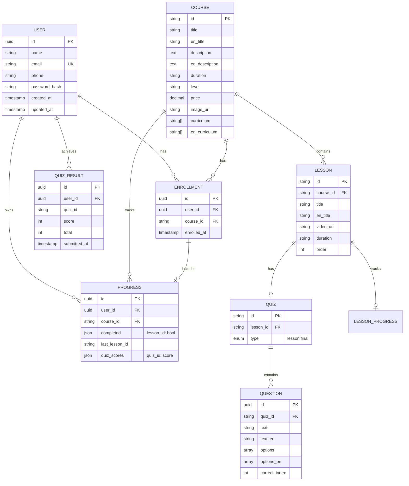

# SAH Academy - Entity-Relationship Diagram (ERD)

## Visual ERD (Mermaid)



---

## Database Schema (SQL)

### Users Table
```sql
CREATE TABLE users (
    id UUID PRIMARY KEY DEFAULT gen_random_uuid(),
    name VARCHAR(255) NOT NULL,
    email VARCHAR(255) UNIQUE NOT NULL,
    phone VARCHAR(50),
    password_hash VARCHAR(255) NOT NULL,
    created_at TIMESTAMP DEFAULT NOW(),
    updated_at TIMESTAMP DEFAULT NOW()
);
```

### Courses Table
```sql
CREATE TABLE courses (
    id VARCHAR(10) PRIMARY KEY,
    title VARCHAR(500) NOT NULL,
    en_title VARCHAR(500),
    description TEXT,
    en_description TEXT,
    duration VARCHAR(50),
    level VARCHAR(50),
    price DECIMAL(10,2),
    image_url TEXT,
    curriculum JSONB,
    en_curriculum JSONB
);
```

### Lessons Table
```sql
CREATE TABLE lessons (
    id VARCHAR(20) PRIMARY KEY,
    course_id VARCHAR(10) REFERENCES courses(id),
    title VARCHAR(500),
    en_title VARCHAR(500),
    video_url TEXT,
    duration VARCHAR(20),
    sort_order INT DEFAULT 1
);
```

### Quizzes Table
```sql
CREATE TABLE quizzes (
    id VARCHAR(30) PRIMARY KEY,
    lesson_id VARCHAR(20) REFERENCES lessons(id),
    type VARCHAR(20) CHECK (type IN ('lesson', 'final'))
);
```

### Questions Table
```sql
CREATE TABLE questions (
    id UUID PRIMARY KEY DEFAULT gen_random_uuid(),
    quiz_id VARCHAR(30) REFERENCES quizzes(id),
    question_text TEXT NOT NULL,
    question_text_en TEXT,
    options JSONB NOT NULL,
    options_en JSONB,
    correct_index INT NOT NULL
);
```

### Enrollments Table
```sql
CREATE TABLE enrollments (
    id UUID PRIMARY KEY DEFAULT gen_random_uuid(),
    user_id UUID REFERENCES users(id),
    course_id VARCHAR(10) REFERENCES courses(id),
    enrolled_at TIMESTAMP DEFAULT NOW(),
    UNIQUE(user_id, course_id)
);
```

### Progress Table
```sql
CREATE TABLE progress (
    id UUID PRIMARY KEY DEFAULT gen_random_uuid(),
    user_id UUID REFERENCES users(id),
    course_id VARCHAR(10) REFERENCES courses(id),
    completed_lessons JSONB DEFAULT '{}',
    last_lesson_id VARCHAR(20),
    quiz_scores JSONB DEFAULT '{}',
    UNIQUE(user_id, course_id)
);
```

### Quiz Results Table
```sql
CREATE TABLE quiz_results (
    id UUID PRIMARY KEY DEFAULT gen_random_uuid(),
    user_id UUID REFERENCES users(id),
    quiz_id VARCHAR(30),
    score INT,
    total INT,
    submitted_at TIMESTAMP DEFAULT NOW()
);
```

---

## Entity Relationships Summary

| Parent Entity | Child Entity | Relationship | Type |
|-------------|-----------|-------------|------|
| User | Enrollment | 1:n | Optional |
| User | Progress | 1:n | Optional |
| User | QuizResult | 1:n | Optional |
| Course | Lesson | 1:n | Mandatory |
| Course | Enrollment | 1:n | Optional |
| Course | Progress | 1:n | Optional |
| Lesson | Quiz | 1:0-1 | Optional |
| Lesson | Progress (via completed) | 1:n | Optional |
| Quiz | Question | 1:n | Mandatory |

---

## API Endpoints

### Authentication
- `POST /api/auth/register` - Create account
- `POST /api/auth/login` - Login
- `POST /api/auth/logout` - Logout
- `GET /api/auth/me` - Current user

### Courses
- `GET /api/courses` - List all
- `GET /api/courses/:id` - Get course
- `GET /api/courses/:id/lessons` - Get lessons

### Enrollments
- `POST /api/enrollments` - Enroll
- `GET /api/enrollments` - User enrollments

### Progress
- `GET /api/progress/:courseId` - Get progress
- `POST /api/progress/:courseId` - Update progress
- `POST /api/progress/:courseId/complete` - Mark lesson complete

### Quizzes
- `GET /api/quizzes/:id` - Get quiz
- `POST /api/quizzes/:id/submit` - Submit answers

---

## Data Flow Example

```
User Registration:
1. POST /api/auth/register {name, email, password}
2. Server creates user record
3. Server generates JWT
4. Response with JWT + user data
5. Client stores JWT
6. Redirect to /app

Enroll in Course:
1. User clicks "Buy" on course details
2. (Payment flow - Phase 3)
3. Server creates enrollment record
4. Server initializes progress
5. Redirect to /learn

Complete Lesson:
1. User finishes video
2. Clicks "Mark Complete"
3. POST /api/progress/:courseId {lesson_id: "v1", completed: true}
4. Server updates progress record
5. UI shows updated percentage

Take Quiz:
1. User clicks quiz button
2. GET /api/quizzes/:id
3. UI displays questions
4. User submits answers
5. POST /api/quizzes/:id/submit {answers: [...]}
6. Server calculates score
7. Server saves quiz result
8. UI shows score
```